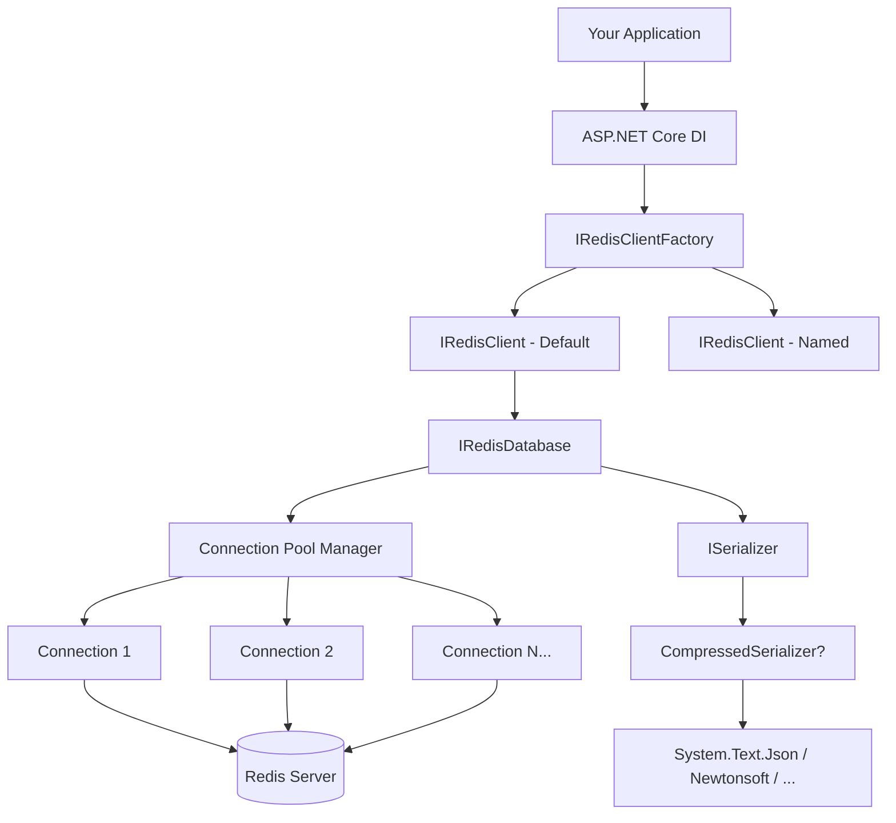
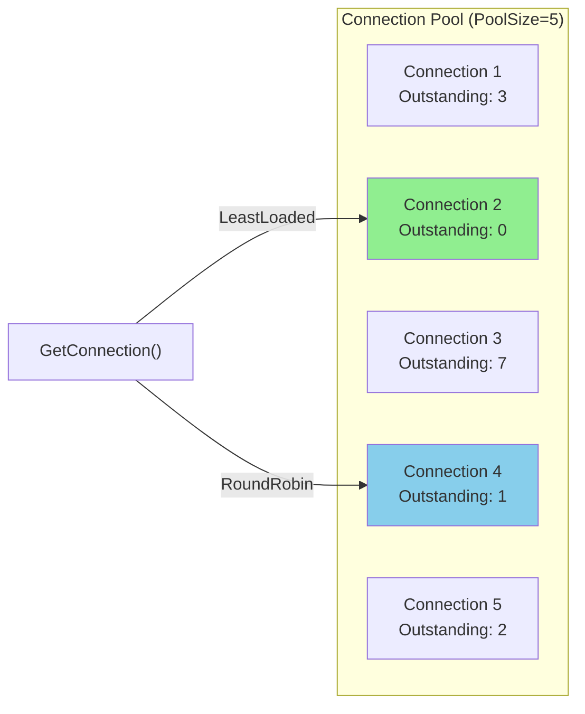

# StackExchange.Redis.Extensions

**StackExchange.Redis.Extensions** is a library that extends [StackExchange.Redis](https://github.com/StackExchange/StackExchange.Redis), making it easier to work with Redis in .NET applications. It wraps the base library with serialization, connection pooling, and higher-level APIs so you can store and retrieve complex objects without writing boilerplate code.

[](https://github.com/imperugo/StackExchange.Redis.Extensions/actions/workflows/ci.yml)
[](https://github.com/imperugo/StackExchange.Redis.Extensions/actions/workflows/codeql.yml)
[](https://www.nuget.org/packages/StackExchange.Redis.Extensions.Core/)


> **AI-Ready:** This library provides an [`llms.txt`](llms.txt) file for AI coding assistants and a Claude Code plugin for configuration, scaffolding, and troubleshooting.
>
> ```bash
> claude plugin add imperugo/StackExchange.Redis.Extensions
> ```
> Then use `/redis-configure`, `/redis-scaffold`, or `/redis-diagnose` in Claude Code.

## Features

- Store and retrieve complex .NET objects with automatic serialization
- Multiple serialization providers (System.Text.Json, Newtonsoft, Protobuf, MsgPack, MemoryPack, and more)
- Connection pooling with LeastLoaded and RoundRobin strategies
- Pub/Sub messaging with typed handlers
- Hash operations with per-field expiry (Redis 7.4+)
- GeoSpatial indexes (GEOADD, GEOSEARCH, GEODIST, etc.)
- Redis Streams with consumer group support
- Set, List, and Sorted Set operations
- Key tagging and search
- Transparent compression (GZip, Brotli, LZ4, Snappy, Zstandard)
- Azure Managed Identity support
- ASP.NET Core integration with DI
- Multiple named Redis instances
- OpenTelemetry integration
- .NET Standard 2.1, .NET 8, .NET 9, .NET 10

## Architecture



## Quick Start

### 1. Install packages

```bash
dotnet add package StackExchange.Redis.Extensions.Core
dotnet add package StackExchange.Redis.Extensions.System.Text.Json
dotnet add package StackExchange.Redis.Extensions.AspNetCore
```

### 2. Configure in `appsettings.json`

```json
{
  "Redis": {
    "Password": "",
    "AllowAdmin": true,
    "Ssl": false,
    "ConnectTimeout": 5000,
    "SyncTimeout": 5000,
    "Database": 0,
    "Hosts": [
      { "Host": "localhost", "Port": 6379 }
    ],
    "PoolSize": 5,
    "IsDefault": true
  }
}
```

### 3. Register in DI

```csharp
var redisConfig = builder.Configuration.GetSection("Redis").Get<RedisConfiguration>();
builder.Services.AddStackExchangeRedisExtensions<SystemTextJsonSerializer>(redisConfig);
```

### 4. Use it

```csharp
public class MyService(IRedisDatabase redis)
{
    public async Task Example()
    {
        // Store an object
        await redis.AddAsync("user:1", new User { Name = "Ugo", Age = 38 });

        // Retrieve it
        var user = await redis.GetAsync<User>("user:1");

        // Store with expiry
        await redis.AddAsync("session:abc", sessionData, TimeSpan.FromMinutes(30));

        // Bulk operations
        var items = new[]
        {
            Tuple.Create("key1", "value1"),
            Tuple.Create("key2", "value2"),
        };
        await redis.AddAllAsync(items, TimeSpan.FromHours(1));

        // Search keys
        var keys = await redis.SearchKeysAsync("user:*");
    }
}
```

## NuGet Packages

### Core

| Package | Description | NuGet |
|---------|------------|-------|
| Core | Core library with abstractions and implementations | [](https://www.nuget.org/packages/StackExchange.Redis.Extensions.Core/) |
| AspNetCore | ASP.NET Core DI integration and middleware | [](https://www.nuget.org/packages/StackExchange.Redis.Extensions.AspNetCore/) |

### Serializers (pick one)

| Package | Description | NuGet |
|---------|------------|-------|
| System.Text.Json | Recommended for most scenarios | [](https://www.nuget.org/packages/StackExchange.Redis.Extensions.System.Text.Json/) |
| Newtonsoft | JSON.NET for legacy compatibility | [](https://www.nuget.org/packages/StackExchange.Redis.Extensions.Newtonsoft/) |
| MemoryPack | High-performance binary (net7.0+) | [](https://www.nuget.org/packages/StackExchange.Redis.Extensions.MemoryPack/) |
| MsgPack | MessagePack binary format | [](https://www.nuget.org/packages/StackExchange.Redis.Extensions.MsgPack/) |
| Protobuf | Protocol Buffers | [](https://www.nuget.org/packages/StackExchange.Redis.Extensions.Protobuf/) |
| Utf8Json | UTF-8 native JSON | [](https://www.nuget.org/packages/StackExchange.Redis.Extensions.Utf8Json/) |

### Compressors (optional)

| Package | Algorithm | Best for | NuGet |
|---------|----------|----------|-------|
| Compression.LZ4 | LZ4 | Lowest latency | [](https://www.nuget.org/packages/StackExchange.Redis.Extensions.Compression.LZ4/) |
| Compression.Snappier | Snappy | Low latency | [](https://www.nuget.org/packages/StackExchange.Redis.Extensions.Compression.Snappier/) |
| Compression.ZstdSharp | Zstandard | Best ratio/speed | [](https://www.nuget.org/packages/StackExchange.Redis.Extensions.Compression.ZstdSharp/) |
| Compression.GZip | GZip | Wide compatibility | [](https://www.nuget.org/packages/StackExchange.Redis.Extensions.Compression.GZip/) |
| Compression.Brotli | Brotli | Best ratio for text | [](https://www.nuget.org/packages/StackExchange.Redis.Extensions.Compression.Brotli/) |

## Usage Examples

### Hash Operations

```csharp
// Set a hash field
await redis.HashSetAsync("user:1", "name", "Ugo");
await redis.HashSetAsync("user:1", "email", "ugo@example.com");

// Get a hash field
var name = await redis.HashGetAsync<string>("user:1", "name");

// Set with per-field expiry (Redis 7.4+)
await redis.HashSetWithExpiryAsync("user:1", "session", sessionData, TimeSpan.FromMinutes(30));

// Query field TTL
var ttl = await redis.HashFieldGetTimeToLiveAsync("user:1", new[] { "session" });
```

### GeoSpatial

```csharp
// Add locations
await redis.GeoAddAsync("restaurants", new[]
{
    new GeoEntry(13.361389, 38.115556, "Pizzeria Da Michele"),
    new GeoEntry(15.087269, 37.502669, "Trattoria del Corso"),
    new GeoEntry(12.496366, 41.902782, "Da Enzo al 29"),
});

// Distance between two places
var km = await redis.GeoDistanceAsync("restaurants",
    "Pizzeria Da Michele", "Trattoria del Corso", GeoUnit.Kilometers);

// Search within 200km of a point
var nearby = await redis.GeoSearchAsync("restaurants", 13.361389, 38.115556,
    new GeoSearchCircle(200, GeoUnit.Kilometers),
    count: 10, order: Order.Ascending);
```

### Redis Streams

```csharp
// Publish typed events
await redis.StreamAddAsync("orders", "payload", new Order { Id = 1, Total = 99.99m });

// Consumer group workflow
await redis.StreamCreateConsumerGroupAsync("orders", "processors");

var entries = await redis.StreamReadGroupAsync("orders", "processors", "worker-1");
foreach (var entry in entries)
{
    // Process the message
    await redis.StreamAcknowledgeAsync("orders", "processors", entry.Id!);
}
```

### Pub/Sub

```csharp
// Subscribe to typed messages
await redis.SubscribeAsync<OrderEvent>("orders:new", async order =>
{
    Console.WriteLine($"New order: {order.Id}");
});

// Publish
await redis.PublishAsync("orders:new", new OrderEvent { Id = 42 });
```

### Compression

```csharp
// Enable transparent compression with any serializer
services.AddStackExchangeRedisExtensions<SystemTextJsonSerializer>(config);
services.AddRedisCompression<LZ4Compressor>();  // That's it!

// All operations automatically compress/decompress
await redis.AddAsync("large-data", myLargeObject);  // stored compressed
var obj = await redis.GetAsync<MyObject>("large-data");  // decompressed automatically
```

### Azure Managed Identity

```csharp
var config = new RedisConfiguration { /* ... */ };
config.ConfigurationOptionsAsyncHandler = async opts =>
{
    await opts.ConfigureForAzureWithTokenCredentialAsync(new DefaultAzureCredential());
    return opts;
};
```

## Connection Pooling



The pool automatically skips disconnected connections and falls back gracefully when all connections are down, letting StackExchange.Redis's internal reconnection logic recover.

| Strategy | Behavior |
|----------|----------|
| `LeastLoaded` (default) | Picks the connected connection with fewest outstanding commands |
| `RoundRobin` | Random selection among connected connections |

## Serialization Behavior

All values stored in Redis go through the configured `ISerializer`. This means:
- A `string` value `"hello"` is stored as `"\"hello\""` (JSON-encoded)
- Use `IRedisDatabase.Database` for raw Redis operations without serialization
- All serializers follow the same convention: `null` input produces an empty byte array

## Configuration Reference

| Property | Default | Description |
|----------|---------|-------------|
| `Hosts` | Required | Redis server endpoints |
| `Password` | `null` | Redis password |
| `Database` | `0` | Database index |
| `Ssl` | `false` | Enable TLS |
| `PoolSize` | `5` | Number of connections in the pool |
| `ConnectionSelectionStrategy` | `LeastLoaded` | Pool selection strategy |
| `SyncTimeout` | `5000` | Sync operation timeout (ms) |
| `ConnectTimeout` | `5000` | Connection timeout (ms) |
| `KeyPrefix` | `""` | Prefix for all keys and channels |
| `AllowAdmin` | `false` | Enable admin commands |
| `ClientName` | `null` | Connection client name |
| `KeepAlive` | `-1` | Heartbeat interval (seconds). -1 = SE.Redis default, 0 = disabled |
| `ServiceName` | `null` | Sentinel service name |
| `MaxValueLength` | `0` | Max serialized value size (0 = unlimited) |
| `WorkCount` | `CPU*2` | I/O threads per SocketManager |
| `ConnectRetry` | `null` | Connection retry count |
| `CertificateValidation` | `null` | TLS certificate validation callback |
| `CertificateSelection` | `null` | TLS client certificate selection callback |
| `ConfigurationOptionsAsyncHandler` | `null` | Async callback for custom ConfigurationOptions setup (e.g. Azure) |

## Documentation

Full documentation is available in the [doc/](doc/) folder:

**Getting Started**
- [Setup & Installation](doc/setup-1.md)
- [Dependency Injection](doc/dependency-injection.md)
- [ASP.NET Core Integration](doc/asp.net-core/README.md)

**Configuration**
- [Configuration Overview](doc/configuration/README.md) — [JSON](doc/configuration/json-configuration.md) | [C#](doc/configuration/c-configuration.md) | [Connection Pool](doc/configuration/connection-pool.md)

**Serializers**
- [Serializers Overview](doc/serializers/README.md) — [System.Text.Json](doc/serializers/system.text.json.md) | [Newtonsoft](doc/serializers/newtonsoft-json.net.md) | [MemoryPack](doc/serializers/memoryPack.md) | [MsgPack](doc/serializers/msgpack.md) | [Protobuf](doc/serializers/protobuf.md)

**Features**
- [Usage Guide](doc/usage/README.md) — Add, Get, Replace, Bulk operations
- [GeoSpatial Indexes](doc/geospatial.md)
- [VectorSet — AI/ML Similarity Search](doc/vectorset.md) (Redis 8.0+)
- [Redis Streams](doc/streams.md)
- [Pub/Sub Messaging](doc/pubsub.md)
- [Hash Field Expiry](doc/hash-field-expiry.md) (Redis 7.4+)
- [Compression](doc/compressors.md) — GZip, Brotli, LZ4, Snappy, Zstandard

**Advanced**
- [Migration Guide: v11 → v12](doc/migration-v11-to-v12.md)
- [Logging & Diagnostics](doc/logging.md)
- [Multiple Redis Servers](doc/multipleServers.md)
- [Azure Managed Identity](doc/azure-managed-identity.md)
- [OpenTelemetry](doc/openTelemetry.md)
- [Redis Information Middleware](doc/asp.net-core/expose-redis-information.md)
- [NuGet Packages](doc/packages.md)

## Contributing

Thanks to all the people who already contributed!

<a href="https://github.com/imperugo/StackExchange.Redis.Extensions/graphs/contributors">
  
</a>

Please read [CONTRIBUTING.md](CONTRIBUTING.md) before submitting a pull request. PRs target the **master** branch only.

## License

StackExchange.Redis.Extensions is Copyright &copy; [Ugo Lattanzi](https://www.linkedin.com/in/imperugo/) and other contributors under the [MIT license](LICENSE).
