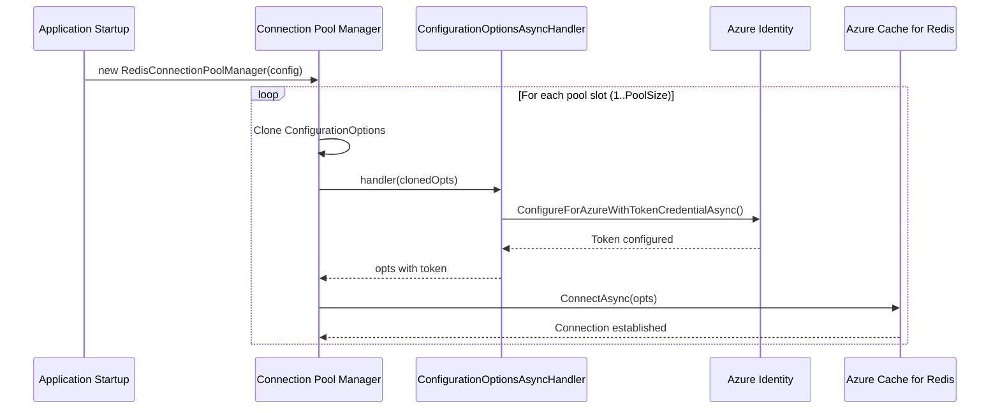

# Azure Managed Identity

Connect to Azure Cache for Redis using Managed Identity instead of passwords.

## Prerequisites

- Azure Cache for Redis with Microsoft Entra ID authentication enabled
- `Microsoft.Azure.StackExchangeRedis` NuGet package in your application
- `Azure.Identity` NuGet package

> The library does NOT reference these packages. The async callback runs entirely in your code.

## Setup

```csharp
using Azure.Identity;

var config = new RedisConfiguration
{
    Hosts = new[] { new RedisHost { Host = "your-cache.redis.cache.windows.net", Port = 6380 } },
    Ssl = true,
    IsDefault = true,
};

// Async callback invoked before each connection in the pool is established
config.ConfigurationOptionsAsyncHandler = async opts =>
{
    await opts.ConfigureForAzureWithTokenCredentialAsync(new DefaultAzureCredential());
    return opts;
};

services.AddStackExchangeRedisExtensions<SystemTextJsonSerializer>(config);
```

## How It Works



Key details:
- `ConfigurationOptions` is **cloned** for each pool slot — no shared state mutation
- The callback is invoked for every connection in the pool (default: 5)
- TLS certificate callbacks (`CertificateValidation`, `CertificateSelection`) are preserved through the clone
- The callback runs during DI singleton construction

## Using with Multiple Redis Instances

```csharp
var azureConfig = new RedisConfiguration
{
    Name = "AzureRedis",
    Hosts = new[] { new RedisHost { Host = "prod.redis.cache.windows.net", Port = 6380 } },
    Ssl = true,
    IsDefault = true,
};
azureConfig.ConfigurationOptionsAsyncHandler = async opts =>
{
    await opts.ConfigureForAzureWithTokenCredentialAsync(new DefaultAzureCredential());
    return opts;
};

var localConfig = new RedisConfiguration
{
    Name = "LocalRedis",
    Hosts = new[] { new RedisHost { Host = "localhost", Port = 6379 } },
};

services.AddStackExchangeRedisExtensions<SystemTextJsonSerializer>(new[] { azureConfig, localConfig });
```
