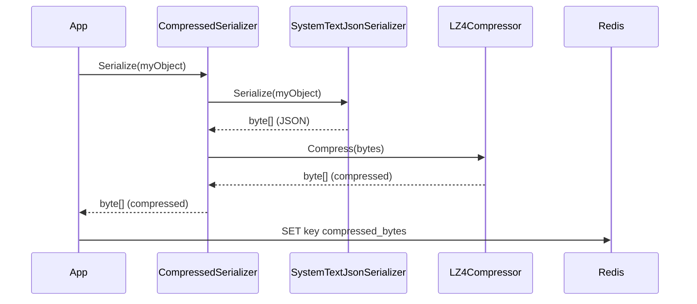

# Compression

StackExchange.Redis.Extensions supports transparent compression of all cached data. Compression is applied after serialization and before storage, reducing Redis memory usage and network bandwidth.

## Architecture


## Available Compressors

| NuGet Package | Class | Algorithm | Speed | Ratio |
|---------------|-------|----------|-------|-------|
| `StackExchange.Redis.Extensions.Compression.LZ4` | `LZ4Compressor` | LZ4 | Fastest | Lower |
| `StackExchange.Redis.Extensions.Compression.Snappier` | `SnappierCompressor` | Snappy | Very Fast | Lower |
| `StackExchange.Redis.Extensions.Compression.ZstdSharp` | `ZstdSharpCompressor` | Zstandard | Fast | Good |
| `StackExchange.Redis.Extensions.Compression.GZip` | `GZipCompressor` | GZip | Moderate | Good |
| `StackExchange.Redis.Extensions.Compression.Brotli` | `BrotliCompressor` | Brotli | Slower | Best |

### Install

```bash
# Pick one:
dotnet add package StackExchange.Redis.Extensions.Compression.LZ4
dotnet add package StackExchange.Redis.Extensions.Compression.Snappier
dotnet add package StackExchange.Redis.Extensions.Compression.ZstdSharp
dotnet add package StackExchange.Redis.Extensions.Compression.GZip
dotnet add package StackExchange.Redis.Extensions.Compression.Brotli
```

### Recommendations

- **Caching with low latency**: Use **LZ4** or **Snappy** (fastest decompression)
- **Large payloads, bandwidth matters**: Use **Zstandard** (best ratio/speed balance)
- **No external dependencies**: Use **GZip** or **Brotli** (built into .NET)

## Setup

### 1. Install the compressor package

```bash
dotnet add package StackExchange.Redis.Extensions.Compression.LZ4
```

### 2. Register in DI

```csharp
// After AddStackExchangeRedisExtensions
services.AddStackExchangeRedisExtensions<SystemTextJsonSerializer>(redisConfig);
services.AddRedisCompression<LZ4Compressor>();
```

That's it. All Redis operations now compress/decompress automatically.

### Manual registration (without DI extension)

```csharp
var serializer = new CompressedSerializer(
    new SystemTextJsonSerializer(),
    new LZ4Compressor()
);

services.AddSingleton<ISerializer>(serializer);
```

## Configuring Compression Level

Each compressor accepts a compression level parameter:

```csharp
// LZ4 — max compression
services.AddRedisCompression(new LZ4Compressor(LZ4Level.L12_MAX));

// GZip — optimal balance
services.AddRedisCompression(new GZipCompressor(CompressionLevel.Optimal));

// Zstandard — level 1-22 (default: 3)
services.AddRedisCompression(new ZstdSharpCompressor(compressionLevel: 6));
```

## Custom Compressor

Implement `ICompressor` to bring your own algorithm:

```csharp
public class MyCompressor : ICompressor
{
    public byte[] Compress(byte[] data) { /* your compression */ }
    public byte[] Decompress(byte[] compressedData) { /* your decompression */ }
}

services.AddRedisCompression(new MyCompressor());
```

## Migration Warning

Enabling compression on an existing dataset will make previously stored (uncompressed) data unreadable. The library will throw an `InvalidOperationException` with a clear message when this happens.

**Migration strategies:**

1. **Fresh start**: Flush the database before enabling compression
2. **Gradual**: Write new data with compression, handle `InvalidOperationException` on reads of old data by falling back to a non-compressed serializer
3. **Dual-read**: Maintain two `IRedisDatabase` instances temporarily (one compressed, one not)

## How It Works

`CompressedSerializer` is a decorator around any `ISerializer`:


