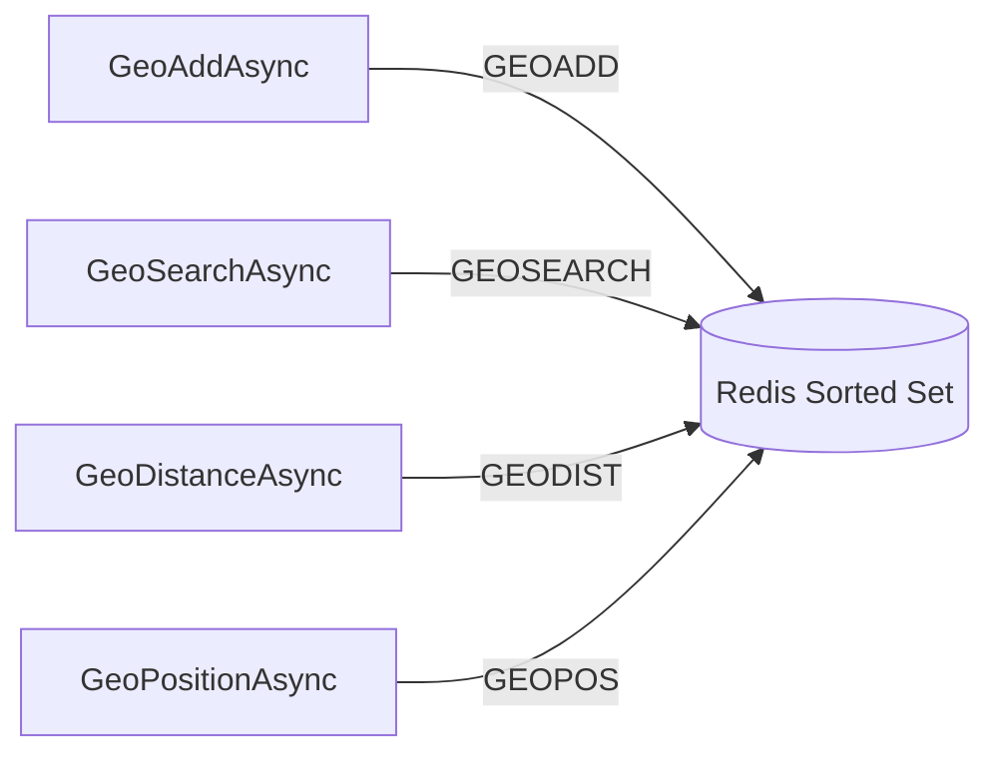

# GeoSpatial

StackExchange.Redis.Extensions wraps Redis's [GeoSpatial commands](https://redis.io/docs/data-types/geospatial/) with a clean, string-based API.

## Adding Locations

```csharp
// Single location
await redis.GeoAddAsync("stores", -73.935242, 40.730610, "NYC Store");

// Multiple locations in one call
await redis.GeoAddAsync("stores", new[]
{
    new GeoEntry(-73.935242, 40.730610, "NYC Store"),
    new GeoEntry(-118.243685, 34.052234, "LA Store"),
    new GeoEntry(-87.629799, 41.878113, "Chicago Store"),
});
```

## Distance Between Members

```csharp
var km = await redis.GeoDistanceAsync("stores", "NYC Store", "LA Store", GeoUnit.Kilometers);
// ~3944 km
```

## Get Coordinates

```csharp
// Single member
var pos = await redis.GeoPositionAsync("stores", "NYC Store");
Console.WriteLine($"Lat: {pos?.Latitude}, Lon: {pos?.Longitude}");

// Multiple members
var positions = await redis.GeoPositionAsync("stores", new[] { "NYC Store", "LA Store" });
```

## Search by Radius

```csharp
// Search within 1000km of coordinates
var nearby = await redis.GeoRadiusAsync("stores",
    -73.935242, 40.730610,
    1000, GeoUnit.Kilometers,
    count: 5, order: Order.Ascending);

foreach (var result in nearby)
    Console.WriteLine($"{result.Member}: {result.Distance}km");
```

## Search by Shape (Redis 6.2+)

```csharp
// Circle search centered on a member
var circle = await redis.GeoSearchAsync("stores", "NYC Store",
    new GeoSearchCircle(500, GeoUnit.Miles));

// Box search centered on coordinates
var box = await redis.GeoSearchAsync("stores", -73.935, 40.730,
    new GeoSearchBox(1000, 500, GeoUnit.Kilometers));
```

## Search and Store Results

```csharp
// Store search results in a new key
var count = await redis.GeoSearchAndStoreAsync(
    "stores", "nearby-nyc", "NYC Store",
    new GeoSearchCircle(100, GeoUnit.Miles));
```

## Remove a Member

```csharp
await redis.GeoRemoveAsync("stores", "Chicago Store");
```

## Get Geohash

```csharp
var hash = await redis.GeoHashAsync("stores", "NYC Store");
// e.g., "dr5regw3pp0"
```

## Architecture



> **Note:** Geo members are string identifiers (e.g., store names, IDs). Coordinates are stored internally by Redis as sorted set scores. If you need to associate complex objects with a location, store them under a key derived from the member name.
