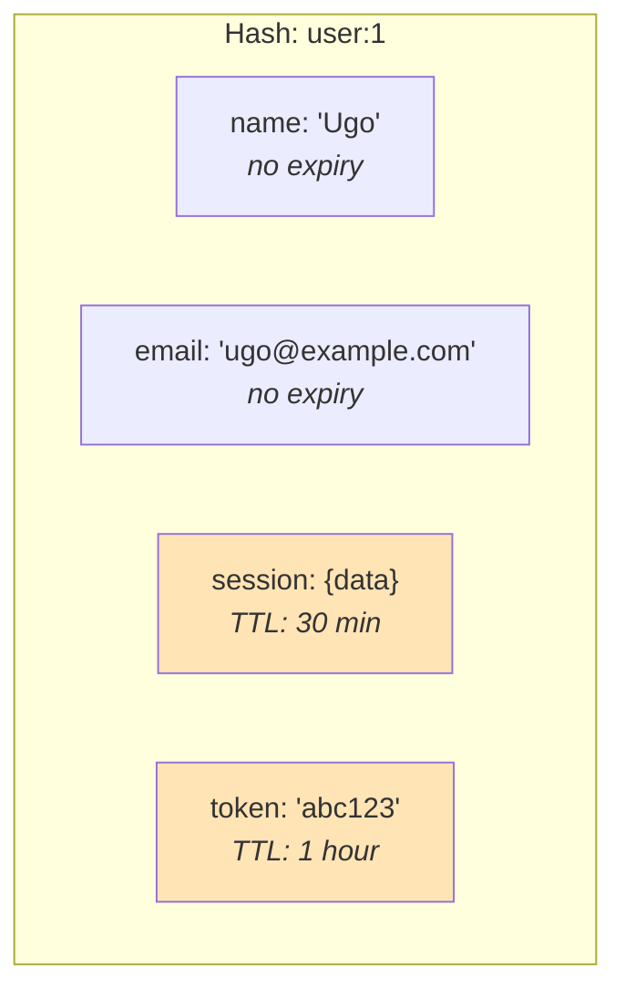

# Hash Field Expiry

Redis 7.4 introduced per-field expiration on hash keys. This allows you to set TTL on individual hash fields instead of the entire key.

> **Requires Redis 7.4+** and StackExchange.Redis 2.12+

## Set a Field with Expiry

```csharp
// Atomic set + expire in one command (HSETEX)
await redis.HashSetWithExpiryAsync("user:1", "session", sessionData, TimeSpan.FromMinutes(30));

// With absolute expiry
await redis.HashSetWithExpiryAsync("user:1", "token", tokenData, DateTime.UtcNow.AddHours(1));
```

## Set Expiry on Existing Fields

```csharp
// Set expiry on one or more fields (HEXPIRE)
var results = await redis.HashFieldExpireAsync("user:1",
    new[] { "session", "token" },
    TimeSpan.FromMinutes(15));

// Check results per field
foreach (var result in results)
    Console.WriteLine(result); // Success, FieldNotFound, etc.
```

## Query Remaining TTL

```csharp
// Get remaining TTL in milliseconds per field (HPTTL)
var ttls = await redis.HashFieldGetTimeToLiveAsync("user:1", new[] { "session", "name" });
// ttls[0] = 899542  (session: ~15 minutes remaining)
// ttls[1] = -1      (name: no expiry)
```

## Remove Expiry

```csharp
// Make fields permanent again (HPERSIST)
var results = await redis.HashFieldPersistAsync("user:1", new[] { "session" });
```

## Use Case: User Sessions with Metadata



This pattern stores permanent user data alongside ephemeral session data in the same hash, without needing separate keys.
