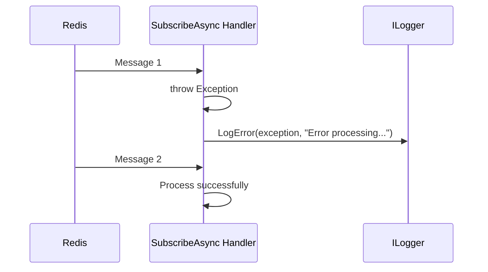

# Pub/Sub

StackExchange.Redis.Extensions wraps Redis [Pub/Sub](https://redis.io/docs/interact/pubsub/) with typed serialization and error handling.

## Subscribe to Messages

```csharp
await redis.SubscribeAsync<OrderEvent>("orders:new", async order =>
{
    Console.WriteLine($"New order #{order.Id} for {order.Total:C}");
    await ProcessOrderAsync(order);
});
```

The handler receives a deserialized object. If the handler throws an exception, it is **logged** (not silently swallowed) and the subscription continues processing subsequent messages.

## Publish Messages

```csharp
var subscriberCount = await redis.PublishAsync("orders:new", new OrderEvent
{
    Id = 42,
    Total = 99.99m,
});
Console.WriteLine($"Message sent to {subscriberCount} subscribers");
```

## Unsubscribe

```csharp
// Unsubscribe a specific handler
await redis.UnsubscribeAsync<OrderEvent>("orders:new", myHandler);

// Unsubscribe all handlers on all channels
await redis.UnsubscribeAllAsync();
```

## How KeyPrefix Affects Channels

When `KeyPrefix` is configured, it is automatically applied to **both keys and Pub/Sub channels** via StackExchange.Redis's `ChannelPrefix` mechanism:

```csharp
// Config: KeyPrefix = "myapp:"
await redis.PublishAsync("orders", message);
// Actual Redis channel: "myapp:orders"
```

You should NOT manually add the prefix to channel names.

## Error Handling

Exceptions in subscription handlers are logged via `ILogger` and do not crash the process or drop the subscription:



> **Note:** For the logger to work in production, ensure `RedisConfiguration.LoggerFactory` is set (it is automatically wired when using `AddStackExchangeRedisExtensions` with ASP.NET Core DI).
