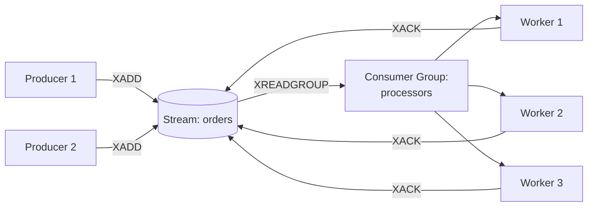

# Redis Streams

StackExchange.Redis.Extensions wraps Redis's [Streams](https://redis.io/docs/data-types/streams/) with typed serialization and consumer group support.

## Overview



## Publishing Messages

### Typed (serialized)

```csharp
// Serialize an object into a single named field
var messageId = await redis.StreamAddAsync("orders", "payload", new Order
{
    Id = 42,
    Total = 99.99m,
    Customer = "Ugo"
});
```

### Raw multi-field

```csharp
// Store multiple fields per message (no serialization)
var messageId = await redis.StreamAddAsync("events", new[]
{
    new NameValueEntry("type", "click"),
    new NameValueEntry("url", "/products"),
    new NameValueEntry("timestamp", DateTimeOffset.UtcNow.ToUnixTimeSeconds().ToString()),
});
```

### With max length (auto-trim)

```csharp
// Keep only the latest 10,000 messages
await redis.StreamAddAsync("logs", "msg", logEntry, maxLength: 10000, useApproximateMaxLength: true);
```

## Reading Messages

### Read from a position

```csharp
// Read all messages from the beginning
var entries = await redis.StreamReadAsync("orders", "0-0");

// Read with limit
var latest = await redis.StreamReadAsync("orders", "0-0", count: 10);
```

### Range queries

```csharp
// All messages
var all = await redis.StreamRangeAsync("orders");

// Reverse order (newest first)
var newest = await redis.StreamRangeAsync("orders", messageOrder: Order.Descending, count: 5);

// Between specific IDs
var range = await redis.StreamRangeAsync("orders", minId: "1234-0", maxId: "5678-0");
```

## Consumer Groups

### Create a group

```csharp
// Start reading from the beginning of the stream
await redis.StreamCreateConsumerGroupAsync("orders", "processors", "0-0");

// Start reading only new messages
await redis.StreamCreateConsumerGroupAsync("orders", "processors", "$");
```

### Read as a consumer

```csharp
// Read new messages for this consumer (> = only new messages)
var entries = await redis.StreamReadGroupAsync("orders", "processors", "worker-1", ">", count: 10);

foreach (var entry in entries)
{
    // Process the message
    var payload = entry.Values[0].Value;

    // Acknowledge successful processing
    await redis.StreamAcknowledgeAsync("orders", "processors", entry.Id!);
}
```

### Check pending messages

```csharp
// Summary
var pending = await redis.StreamPendingAsync("orders", "processors");
Console.WriteLine($"Pending: {pending.PendingMessageCount}");

// Detailed per-message info
var details = await redis.StreamPendingMessagesAsync("orders", "processors",
    count: 10, consumerName: RedisValue.Null);
```

### Manage groups

```csharp
// Reset group position
await redis.StreamConsumerGroupSetPositionAsync("orders", "processors", "0-0");

// Remove a consumer
await redis.StreamDeleteConsumerAsync("orders", "processors", "worker-1");

// Delete the group
await redis.StreamDeleteConsumerGroupAsync("orders", "processors");
```

## Stream Management

```csharp
// Get stream length
var length = await redis.StreamLengthAsync("orders");

// Trim to max length
await redis.StreamTrimAsync("orders", 1000);

// Delete specific messages
await redis.StreamDeleteAsync("orders", new[] { "1234-0", "5678-0" });
```

## Deserializing Typed Messages

When using `StreamAddAsync<T>`, the object is serialized into a single field. To deserialize when reading:

```csharp
var entries = await redis.StreamRangeAsync("orders");

foreach (var entry in entries)
{
    // The serialized object is in the field you specified during XADD
    var orderBytes = (byte[])entry.Values.First(v => v.Name == "payload").Value!;
    var order = redis.Serializer.Deserialize<Order>(orderBytes);
}
```

> **Note:** For advanced operations (XCLAIM, XAUTOCLAIM, XINFO), use `redis.Database` to access the underlying StackExchange.Redis `IDatabase` directly.
