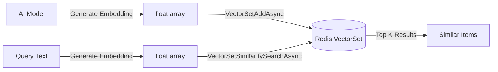

# VectorSet (AI/ML Similarity Search)

Redis 8.0 introduced VectorSet — a native data structure for storing and searching high-dimensional vectors. This is ideal for AI/ML applications like RAG, recommendations, and semantic search.

> **Requires Redis 8.0+**

## Overview



## Adding Vectors

```csharp
// Add a vector with a member name
var embedding = await aiModel.GetEmbeddingAsync("Red running shoes, size 42");

await redis.VectorSetAddAsync("products",
    VectorSetAddRequest.Create("shoe-123", embedding));

// Add with JSON attributes (metadata)
await redis.VectorSetAddAsync("products",
    VectorSetAddRequest.Create("shoe-456", embedding)
        .WithAttributes("""{"category":"shoes","price":79.99,"brand":"Nike"}"""));
```

## Similarity Search

```csharp
// Find the 5 most similar items to a query vector
var queryEmbedding = await aiModel.GetEmbeddingAsync("comfortable sneakers for running");

var results = await redis.VectorSetSimilaritySearchAsync("products",
    VectorSetSimilaritySearchRequest.Create(queryEmbedding, count: 5));

foreach (var result in results)
{
    Console.WriteLine($"{result.Member}: score={result.Score:F4}");

    // Get attributes for each result
    var attrs = await redis.VectorSetGetAttributesJsonAsync("products", result.Member!);
    Console.WriteLine($"  Attributes: {attrs}");
}
```

## Managing Vectors

```csharp
// Check if a member exists
var exists = await redis.VectorSetContainsAsync("products", "shoe-123");

// Get cardinality
var count = await redis.VectorSetLengthAsync("products");

// Get vector dimensions
var dims = await redis.VectorSetDimensionAsync("products");

// Get a random member
var random = await redis.VectorSetRandomMemberAsync("products");

// Get info about the VectorSet
var info = await redis.VectorSetInfoAsync("products");

// Remove a member
await redis.VectorSetRemoveAsync("products", "shoe-123");
```

## Attributes (Metadata)

```csharp
// Set JSON attributes on a member
await redis.VectorSetSetAttributesJsonAsync("products", "shoe-123",
    """{"category":"shoes","price":99.99,"sizes":[40,41,42]}""");

// Get JSON attributes
var json = await redis.VectorSetGetAttributesJsonAsync("products", "shoe-123");
```

## Use Cases

### RAG (Retrieval-Augmented Generation)
```csharp
// Index documents
foreach (var doc in documents)
{
    var embedding = await aiModel.GetEmbeddingAsync(doc.Content);
    await redis.VectorSetAddAsync("docs",
        VectorSetAddRequest.Create(doc.Id, embedding)
            .WithAttributes($"""{{ "title": "{doc.Title}" }}"""));
}

// Query: find relevant context for a prompt
var queryEmb = await aiModel.GetEmbeddingAsync(userQuestion);
var context = await redis.VectorSetSimilaritySearchAsync("docs",
    VectorSetSimilaritySearchRequest.Create(queryEmb, count: 3));
```

### Recommendations
```csharp
// Find products similar to what the user just viewed
var viewedProduct = await redis.VectorSetGetApproximateVectorAsync("products", productId);
// Use the vector to find similar items
```

### Semantic Search
```csharp
// Search by meaning, not keywords
var searchEmb = await aiModel.GetEmbeddingAsync("something warm for winter");
var results = await redis.VectorSetSimilaritySearchAsync("clothing",
    VectorSetSimilaritySearchRequest.Create(searchEmb, count: 20));
```

## Performance Notes

- VectorSet uses HNSW (Hierarchical Navigable Small World) algorithm internally
- Approximate nearest neighbor search — extremely fast even with millions of vectors
- Memory efficient compared to external vector databases
- Vectors are stored directly in Redis — no external index to maintain
