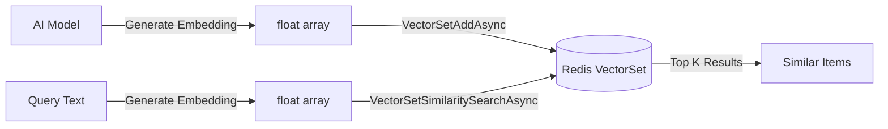

# VectorSet (AI/ML Similarity Search)

Redis 8.0 introduced VectorSet — a native data structure for storing and searching high-dimensional vectors. This is ideal for AI/ML applications like RAG, recommendations, and semantic search.

> **Requires Redis 8.0+**

## Overview



## Adding Vectors

```csharp
// Add a vector with a member name
var embedding = await aiModel.GetEmbeddingAsync("Red running shoes, size 42");

await redis.VectorSetAddAsync("products",
    VectorSetAddRequest.Member("shoe-123", embedding));

// Add with JSON attributes (metadata)
await redis.VectorSetAddAsync("products",
    VectorSetAddRequest.Member("shoe-456", embedding, 
        attributes: """{"category":"shoes","price":79.99,"brand":"Nike"}"""));
```

## Similarity Search

The search returns a `Lease<T>` which **must be disposed** after use to return pooled memory.

```csharp
// Find the 5 most similar items to a query vector
var queryEmbedding = await aiModel.GetEmbeddingAsync("comfortable sneakers for running");

using var results = await redis.VectorSetSimilaritySearchAsync("products",
    VectorSetSimilaritySearchRequest.ByVector(queryEmbedding) with { Count = 5 });

if (results is not null)
{
    foreach (var result in results.Span)
    {
        Console.WriteLine($"{result.Member}: score={result.Score:F4}");

        // Get attributes for each result
        var attrs = await redis.VectorSetGetAttributesJsonAsync("products", result.Member!);
        Console.WriteLine($"  Attributes: {attrs}");
    }
}
```

## Managing Vectors

```csharp
// Check if a member exists
var exists = await redis.VectorSetContainsAsync("products", "shoe-123");

// Get cardinality
var count = await redis.VectorSetLengthAsync("products");

// Get vector dimensions
var dims = await redis.VectorSetDimensionAsync("products");

// Get a random member
var random = await redis.VectorSetRandomMemberAsync("products");

// Get multiple random members
var randoms = await redis.VectorSetRandomMembersAsync("products", 5);

// Get info about the VectorSet
var info = await redis.VectorSetInfoAsync("products");

// Get the approximate vector for a member
using var vector = await redis.VectorSetGetApproximateVectorAsync("products", "shoe-123");

// Get HNSW graph neighbors
var links = await redis.VectorSetGetLinksAsync("products", "shoe-123");
var linksWithScores = await redis.VectorSetGetLinksWithScoresAsync("products", "shoe-123");

// Remove a member
await redis.VectorSetRemoveAsync("products", "shoe-123");
```

## Attributes (Metadata)

```csharp
// Set JSON attributes on a member
await redis.VectorSetSetAttributesJsonAsync("products", "shoe-123",
    """{"category":"shoes","price":99.99,"sizes":[40,41,42]}""");

// Get JSON attributes
var json = await redis.VectorSetGetAttributesJsonAsync("products", "shoe-123");
```

## Use Cases

### RAG (Retrieval-Augmented Generation)
```csharp
// Index documents
foreach (var doc in documents)
{
    var embedding = await aiModel.GetEmbeddingAsync(doc.Content);
    await redis.VectorSetAddAsync("docs",
        VectorSetAddRequest.Member(doc.Id, embedding,
            attributes: $"""{{ "title": "{doc.Title}" }}"""));
}

// Query: find relevant context for a prompt
using var context = await redis.VectorSetSimilaritySearchAsync("docs",
    VectorSetSimilaritySearchRequest.ByVector(queryEmb) with { Count = 3 });
```

### Recommendations
```csharp
// Find products similar to what the user just viewed
using var vector = await redis.VectorSetGetApproximateVectorAsync("products", viewedProductId);
if (vector is not null)
{
    using var similar = await redis.VectorSetSimilaritySearchAsync("products",
        VectorSetSimilaritySearchRequest.ByVector(vector.Span.ToArray()) with { Count = 10 });
}
```

### Semantic Search
```csharp
// Search by meaning, not keywords
var searchEmb = await aiModel.GetEmbeddingAsync("something warm for winter");
using var results = await redis.VectorSetSimilaritySearchAsync("clothing",
    VectorSetSimilaritySearchRequest.ByVector(searchEmb) with { Count = 20 });
```

## API Reference

| Method | Redis Command | Returns |
|--------|--------------|---------|
| `VectorSetAddAsync(key, request)` | VADD | `Task<bool>` |
| `VectorSetSimilaritySearchAsync(key, query)` | VSIM | `Task<Lease<VectorSetSimilaritySearchResult>?>` (dispose!) |
| `VectorSetRemoveAsync(key, member)` | VREM | `Task<bool>` |
| `VectorSetContainsAsync(key, member)` | VCONTAINS | `Task<bool>` |
| `VectorSetLengthAsync(key)` | VCARD | `Task<long>` |
| `VectorSetDimensionAsync(key)` | VDIM | `Task<long>` |
| `VectorSetGetAttributesJsonAsync(key, member)` | VGETATTR | `Task<string?>` |
| `VectorSetSetAttributesJsonAsync(key, member, json)` | VSETATTR | `Task<bool>` |
| `VectorSetInfoAsync(key)` | VINFO | `Task<VectorSetInfo?>` |
| `VectorSetRandomMemberAsync(key)` | VRANDMEMBER | `Task<RedisValue>` |
| `VectorSetRandomMembersAsync(key, count)` | VRANDMEMBER | `Task<RedisValue[]>` |
| `VectorSetGetApproximateVectorAsync(key, member)` | VGETAPPROX | `Task<Lease<float>?>` (dispose!) |
| `VectorSetGetLinksAsync(key, member)` | VLINKS | `Task<Lease<RedisValue>?>` (dispose!) |
| `VectorSetGetLinksWithScoresAsync(key, member)` | VLINKS WITHSCORES | `Task<Lease<VectorSetLink>?>` (dispose!) |

**SE.Redis types used:** `VectorSetAddRequest.Member(member, vector)`, `VectorSetSimilaritySearchRequest.ByVector(vector)`, `Lease<T>` (IDisposable — always use `using`).

## Performance Notes

- VectorSet uses HNSW (Hierarchical Navigable Small World) algorithm internally
- Approximate nearest neighbor search — extremely fast even with millions of vectors
- Memory efficient compared to external vector databases
- Vectors are stored directly in Redis — no external index to maintain
- `Lease<T>` return types use pooled memory — always dispose after use
